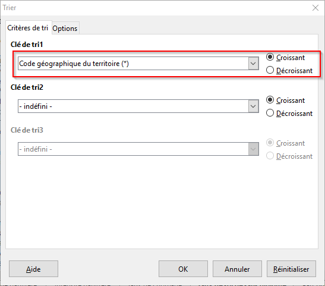
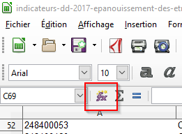

class: center, middle, inverse

# `r icon::fa("pencil-alt", size = 1)` À vous de jouer

---
class: center, middle

# Créer un tableau depuis les instructions suivantes :

- Aix-en-Provence compte 141438 habitants. Son code INSEE est 13090 et elle appartient aux Bouches-du-Rhône.
- Marseille appartient au même département. Elle compte 850726 habitants. Son code INSEE est 13055
- Nice (06088) est une commune des Alpes-Maritimes. Elle compte 343304 habitants.

---
class: center, middle

# Récupérer la population par département sur la région PACA et en faire un tableau en faisant apparaître également le code INSEE de chaque département

---
class: center, middle

# Quelle caractéristique de l'OpenData peut influencer la façon de structurer la donnée ?

--
Voici les consignes de réalisation d'un tableau pour que ce dernier soit traitable par une machine :

- Souvent, un logiciel s'attend à ce qui est le plus conventionnel, soit que les variables, champs apparaissent en colonnes, et les entités, enregistrements, en lignes
- Noms de champs courts, voire abréviés, pour faciliter le travail des programmeurs
- Pas d'espaces, ni d'accents dans les noms d'attributs, ni de majuscules, sinon les logiciels de traitement peuvent planter

---
class: center, middle

# Refaire le tableau en respectant ces préceptes

---
class: center, middle

# Quel est le département le plus peuplé
# Quelle est la population totale en PACA ?

<!-- --- -->
<!-- class: center, middle -->

<!-- # Prendre les données de population à Marseille, Aix en Provence, Nice et en faire un tableau -->

<!-- --- -->
<!-- class: center, middle -->

<!-- # Quelle ville compte le plus d'habitants ? -->

<!-- --- -->
<!-- class: center, middle -->

<!-- # Rechercher sur Internet les informations sur Toulon et compléter le tableau -->

<!-- --- -->
<!-- class: center, middle -->

<!-- # Calculer le nombre d'habitants total sur ces 4 villes -->

---
class: center, middle, inverse

# `r icon::fa("table", size = 1)` Opérations de base sous Excel ou LibreOffice

###Rappel de quelques fonctions utiles avant de commencer

---

## Trier un tableau de données
- Sélectionner le tableau à trier en incluant les noms de colonnes
- Aller dans `Données > Trier`
- Dire que la première ligne contient les en-têtes de colonnes

</img>

---
- Réaliser le tri

---
## Calculer des statistiques agrégées
### Moyenne
- Se positionner sur une cellule qui contiendra la valeur de moyenne

- Cliquer sur le bouton `Fonction`

- Choisir la fonction souhaitée, dans notre cas la `MOYENNE`

---

- Dire quelle est la plage des valeurs dont on souhaite calculer la moyenne : tracer un rectangle englobant les valeurs souhaitées

</img>

On peut faire de même pour calculer des sommes, etc...

---
class: center, middle, inverse

# Indicateurs de développement durable sur l'épanouissement des êtres humains 

[`r icon::fa("file", size = 2, colour = "rgb(249, 38, 114);")` Cliquez ici pour accéder au dataset](https://trouver.datasud.fr/dataset/epanouissement-de-tous-les-etres-humains-indicateurs-de-developpement-durable)

---
class: exo

##Exo 4
&#9658; <u>Revue post-téléchargement</u>

1. Combien de fichiers trouve-t-on dans le lot de données ? Sont-ils tous différents ? Combien de jeux de données différents trouve-t-on en réalité ? Y en a-t-il en trop, en doublons ?
<!-- on en trouve 4 et il y a trois fichiers en double : Indicateurs DD-2017-Epanouissement des êtres humains.xls, Indicateurs DD-2017-Epanouissement des êtres humains.ods et Indicateurs DD2017_finalité 3 : épanouissement de tous ...
Les fichiers uniques sont indicateurs-dd-2017-epanouissement-des-etres-humains.ods et synthese-indicateurs-dd-paca-2017.xls -->

2. Quel fichier comprend l'ensemble des indicateurs/volets listés dans la documentation ? Peut-on conduire une étude portant sur l'ensemble de ces indicateurs à l'échelle des Bouches-du-Rhône ?
<!-- dans le fichier Indicateurs DD-2017-Epanouissement des êtres humains.ods -->

3. Quel jeu de données comprend des données précises ? Y retrouve-t-on l'intégralité des indicateurs ?
<!-- le fichier Indicateurs DD-2017-Epanouissement des êtres humains.ods. Oui, ils y sont tous -->

---
class:exo

##Exo 5
&#9658; <u>Structure des fichiers</u>

1. Dans le fichier *synthese*, les variables apparaissent-elles en colonnes ou en lignes ? Et dans les autres fichiers ?
<!-- dans synthese : variables en lignes -->

2. Dans le fichier *detail*, que signifie à votre avis la valeur *nd* dans l'onglet sur la qualité de l'air ? Pourquoi est-il plus important de mettre cette valeur que de laisser la cellule vide ?
<!-- non déterminé -->

---
class:exo

##Exo 6
&#9658; <u>Contenu</u>

1. PACA est-elle une région bruyante ?
<!-- 34.1 vs 14.2 -->

2. Après les Bouches-du-Rhône, dans quel département est-on le plus exposé au bruit ?
<!-- Alpes Maritimes -->

3. **Classer les grandes agglomérations de PACA** en fonction de la qualité de l'air en 2012 et dire quelles communes sont les 3 communes les plus polluées et les 3 communes les moins polluées

<!-- Marseille, Cannes Grasse Antibes, puis Toulon -->