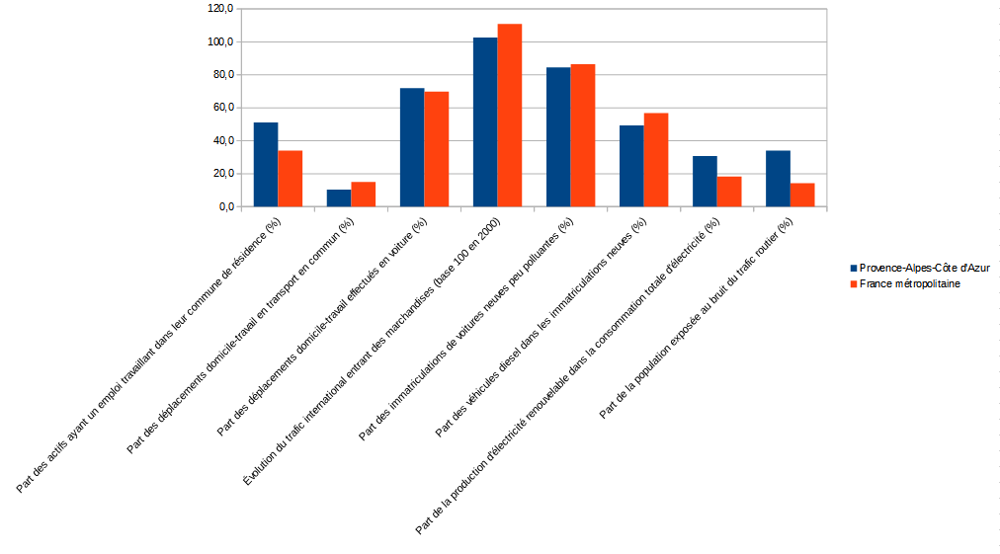
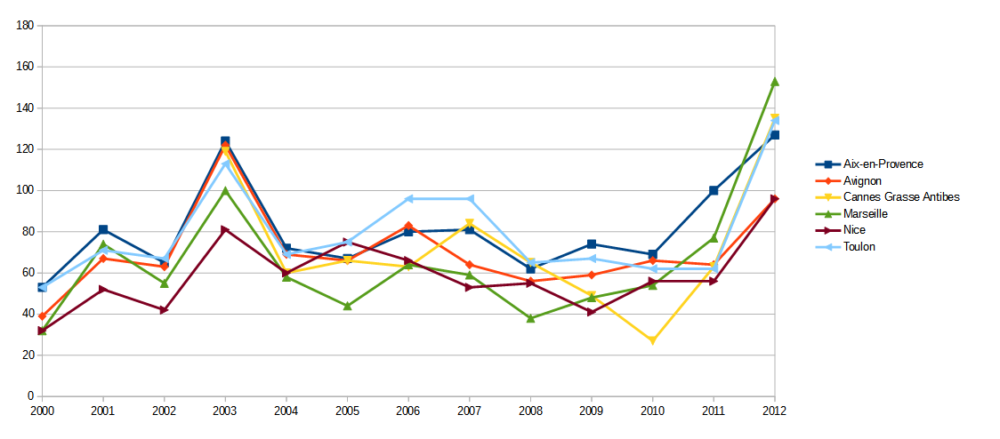

class: center, middle, inverse

# `r icon::fa("pencil-alt", size = 1)` À vous de jouer

---
class: center, middle

#Prendre le tableau des populations à Aix en Provence, Marseille et Nice : quelles formes graphiques pourriez-vous utiliser pour la représenter visuellement ?

---
class: center, middle

#Dessiner à la main un graphique de la population sur ces trois villes sous la forme de :

Barres

Camemberts

---
class: center, middle

#Quel avantage voyez-vous pour les graphiques par rapport au tableau ?

---
class: center, middle

#Que préférez-vous : les barres ou camemberts ? Pourquoi ?

---
class: center, middle

# Créer un tableau contenant l'évolution de la population d'Aix en Provence :

1968 : 89566 habitants

1975 : 110659

1990 : 123842

1999 : 134324 

2007 : 143404 

# Repérer le minimum et le maximum, les arrondir au millier

---
class: center, middle

# Créer un graphique qui rende compte de l'évolution de la population

---
class: center, middle

# Mettre le contenu de ce tableau dans LibreOffice

---
class: center, middle, inverse

# `r icon::fa("table", size = 1)` Opérations de base sous Excel ou LibreOffice
### Rappel de quelques fonctions utiles avant de commencer
---
Pour créer des graphiques sous Excel, on sélectionne la plage de données qui nous intéresse (avec les titres), si nécessaire en appuyant sur la touche Ctrl si les colonnes ou lignes sont disjointes, puis on va dans le menu `Insertion > Diagramme`.

Plusieurs sortes de diagrammes nous sont alors proposés : en barres, camemberts, séries temporelles, ...

---
class: center, middle

# Créer un diagramme en barre de la population sous LibreOffice

---
class: center, middle

# Créer un diagramme en camembert de la population sous LibreOffice

---
class: center, middle

# Créer un graphique en ligne de l'évolution de la population sous LibreOffice

---
class: center, middle, inverse
#Comparer PACA et France métropolitaine

`r icon::fa("chart-pie", size = 4)`

---
class:exo

`r icon::fa("file", size = 1)` Considérer le jeu de données : <a href=https://trouver.datasud.fr/dataset/epanouissement-de-tous-les-etres-humains-indicateurs-de-developpement-durable>indicateurs de développement durable sur l'épanouissement des êtres humains</a>

##Exo 7
&#9658; Comparer, sous forme de graphique en barres, la situation de la région par rapport au territoire national pour ce qui est de :

- la part des déplacements domicile-travail effectués en voiture (%)

---
class:exo 

##Exo 11
&#9658; Comparer à présent sous la forme de graphiques en barres :

  - la part des actifs ayant un emploi travaillant dans leur commune de résidence (%)
  
  - la part des déplacements domicile-travail en transport en commun (%)
  
  - la part des déplacements domicile-travail effectués en voiture (%)
  
  - l'évolution du trafic international entrant des marchandises (base 100 en 2000)
  
  - la part des immatriculations de voitures neuves peu polluantes (%)
  
  - la part des véhicules diesel dans les immatriculations neuves (%)
  
  - la part de la population exposée au bruit du trafic routier (%)

---

---
class: center, middle, inverse
#Évolution temporelle

`r icon::fa("chart-area", size = 4)`

---
class:exo

##Exo 12
&#9658; Réaliser des graphiques en lignes qui montrent l'évolution, de 2000 à 2012, du nombre jours avec une qualité de l'air médiocre pour les agglomérations concernées de PACA

--

