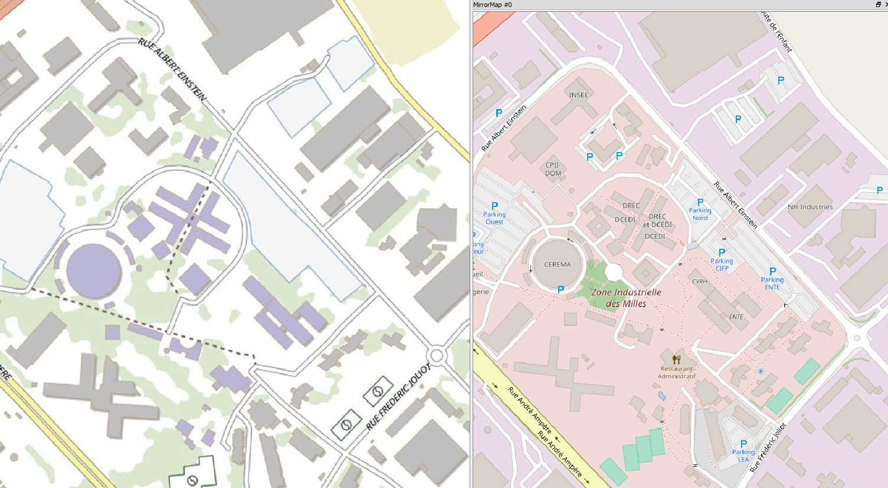

class: center, middle, inverse

# Cartographier

`r icon::fa("map-marked", size = 4)`

---
class: center, middle

# Quelle carte préférez-vous, et pourquoi ?

---
class: middle

<!-- --- -->
<!-- class: center, middle -->

<!-- # Dessiner la région PACA -->

<!-- --- -->
<!-- class: center, middle -->

<!-- # Selon vous, que peut-on utiliser, visuellement, pour représenter des quantités, des classes ? -->

<!-- --- -->
<!-- class: center, middle -->

<!-- # Rechercher la population par département en PACA et en faire un tableau -->

<!-- --- -->
<!-- #Faire une carte de la population en PACA par département : -->

<!-- - Utiliser des couleurs -->
<!-- - Utiliser des formes géométriques -->
<!-- - Utiliser des hâchures -->
<!-- - Quel pictogramme utiliseriez-vous pour la population ? Dessiner la carte avec un pictogramme -->

---
class: exo
Dans cet exercice, nous allons nous intéresser à :

`r icon::fa("file", size = 1)` <a href=https://trouver.datasud.fr/dataset/implantations-des-etablissements-denseignement-superieur-publics-en-provence-alpes-cote-dazur>La localisation des établissements supérieurs publics en PACA</a>

Nous allons représenter l'effectif de ces établissements de façon visuelle sur une carte. 

`r icon::fa("arrow-circle-down", size = 1)` Cliquez sur télécharger au niveau fichier spatial GeoJSON afin de récupérer la donnée sur votre ordinateur.

</img>

---
## Magrit

Nous allons utiliser l'outil [Magrit (http://magrit.cnrs.fr/)](http://magrit.cnrs.fr/) du CNRS. Magrit est un outil de création de cartes en ligne. Il ne nécessite aucune installation. Il permet de visualiser des données géographiques et d'en réaliser des cartes, notamment statistiques,.

Pour démarrer, allez sur le site de [Magrit](http://magrit.cnrs.fr/) et cliquez sur `démarrer`

</img>

---
## Ajout d'un fonds Communes de PACA
On ouvre un fonds de carte et on choisit le fonds Provence Alpes Côte d'Azur. Ce dernier affiche les contours des communes de la Région.

On définit ce fonds comme étant, non le fonds principal, mais un *fonds d'habillage*.
 
</img>

---
## Ajout des établissements
On ajoute ensuite un jeu de données préalablement téléchargé

On définit cette donnée comme constituant le *fonds principal* de notre carte

On doit définir de quel type sont chacun des champs. Cela est nécessaire afin de pouvoir représenter visuellement des variables (colonnes) de façon correcte. Dans notre cas, on s'intéresse à l'**effectif** des établissements.

</img>

---
## Choix d'une représentation
Ensuite, nous allons dans *Choix de la représentation* et nous cliquons sur la représentation en *bulles*, avec l'objectif de faire apparaître un établissement dans une bulle d'autant plus grosse qu'elle compte d'élèves.

Nous choisissons l'effectif comme variable à représenter, puis nous cliquons sur *Dessiner le résultat*

</img>

---
## Visualiser le tableau des données
Il est aussi possible d'explorer les données avec l'icône *Explorer*.

Il s'affiche alors un tableau des données

</img>

---
## Représentation des communes en fonction du département
On peut aussi représenter des variables qualitatives sur la carte, par exemple sur la couche `Communes PACA` qu'on définit comme `Fonds principal`. Puis on choisit son mode de représentation.

</img>

---
## Export
On peut exporter la carte à différents formats, notamment en image

 
</img>

