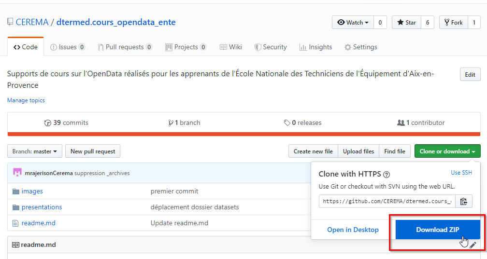

# Une journée de formation sur l'Open Data   

<!---->

Supports d'un cours sur l'Open Data réalisé en 2018 pour les apprenants de l'ENTE d'Aix-en-Provence (École Nationale des Techniciens de l'Équipement)  

:point_right: ["Le Cerema Méditerranée sensibilise les apprenants de l’École Nationale des Techniciens de l’Équipement d’Aix-en-Provence à l’Open Data"](https://www.cerema.fr/fr/actualites/cerema-mediterranee-sensibilise-apprenants-ecole-nationale)

## :books: Session 1 (cours) ½j 
- Généralités sur la Data  [html](https://github.com/CEREMA/dtermed.cours_opendata_ente/blob/master/presentations/session1/session1_1_data.html) [pdf](https://github.com/CEREMA/dtermed.cours_opendata_ente/blob/master/presentations/session1/session1_1_data.pdf)
- Fondements et contexte législatif entourant l'OpenData  [html](https://github.com/CEREMA/dtermed.cours_opendata_ente/blob/master/presentations/session1/session1_2_fondements.html) [pdf](https://github.com/CEREMA/dtermed.cours_opendata_ente/blob/master/presentations/session1/session1_2_fondements.pdf)
- Les portails OpenData  [html](https://github.com/CEREMA/dtermed.cours_opendata_ente/blob/master/presentations/session1/session1_3_portails.html) [pdf](https://github.com/CEREMA/dtermed.cours_opendata_ente/blob/master/presentations/session1/session1_3_portails.pdf)
- Les acteurs de l'OpenData  [html](https://github.com/CEREMA/dtermed.cours_opendata_ente/blob/master/presentations/session1/session1_4_acteurs.html) [pdf](https://github.com/CEREMA/dtermed.cours_opendata_ente/blob/master/presentations/session1/session1_4_acteurs.pdf)
- Avant de vous présenter à la Data  [html](https://github.com/CEREMA/dtermed.cours_opendata_ente/blob/master/presentations/session1/session1_5_avant_data.html) [pdf](https://github.com/CEREMA/dtermed.cours_opendata_ente/blob/master/presentations/session1/session1_5_avant_data.pdf)
- Rendez-vous avec la Data  [html](https://github.com/CEREMA/dtermed.cours_opendata_ente/blob/master/presentations/session1/session1_6_rdv_data.html) [pdf](https://github.com/CEREMA/dtermed.cours_opendata_ente/blob/master/presentations/session1/session1_6_rdv_data.pdf)
- Quizz  [html](https://github.com/CEREMA/dtermed.cours_opendata_ente/blob/master/presentations/session1/session1_7_quizz.html) [pdf](https://github.com/CEREMA/dtermed.cours_opendata_ente/blob/master/presentations/session1/sesion_1_7_quizz.pdf)

## :computer: Session 2 (travaux pratiques) ½j 
- Énoncé du défi  [html](https://github.com/CEREMA/dtermed.cours_opendata_ente/blob/master/presentations/session2/session2_1_énoncé.html) [pdf](https://github.com/CEREMA/dtermed.cours_opendata_ente/blob/master/presentations/session2/session2_1_énoncé.pdf)
- Accéder à la donnée et en prendre connaissance  [html](https://github.com/CEREMA/dtermed.cours_opendata_ente/blob/master/presentations/session2/session2_2_acceder_prendre_connaissance.html) [pdf](https://github.com/CEREMA/dtermed.cours_opendata_ente/blob/master/presentations/session2/session2_2_acceder_prendre_connaissance.pdf)
- Explorer  [html](https://github.com/CEREMA/dtermed.cours_opendata_ente/blob/master/presentations/session2/session2_3_explorer.html) [pdf](https://github.com/CEREMA/dtermed.cours_opendata_ente/blob/master/presentations/session2/session2_3_explorer.pdf)
- Visualiser  [html](https://github.com/CEREMA/dtermed.cours_opendata_ente/blob/master/presentations/session2/session2_4_visualiser.html) [pdf](https://github.com/CEREMA/dtermed.cours_opendata_ente/blob/master/presentations/session2/session2_4_visualiser.pdf)
- Cartographier  [html](https://github.com/CEREMA/dtermed.cours_opendata_ente/blob/master/presentations/session2/session2_5_cartographier.html) [pdf](https://github.com/CEREMA/dtermed.cours_opendata_ente/blob/master/presentations/session2/session2_5_cartographier.pdf)
- Outils (annexe)  [html](https://github.com/CEREMA/dtermed.cours_opendata_ente/blob/master/presentations/session2/session2_6_annexe_outils.html) [pdf](https://github.com/CEREMA/dtermed.cours_opendata_ente/blob/master/presentations/session2/session2_6_annexe_outils.pdf)

## Téléchargement des supports
Réaliser la manipulation suivante :  
Télécharger le zip.  
Les supports seront présents dans le dossier **presentations**

## Réalisation
### Auteur des supports
Mathieu Rajerison, du service GTIE (Géomatique, Trafics, ITS et Exploitation) du CEREMA Med (Centre d'Études et d'Expertise sur les Risques, l'Environnement, la Mobilité et l'Améngament de la région Méditerranée)

### Version
- Dernière mise à jour : 12 Novembre 2019
- Création :             24 Août 2018

### Format
- html & pdf
- Sources : format [R Markdown](https://rmarkdown.rstudio.com/), librairie [xaringan](https://github.com/yihui/xaringan)

### Licence
</img>  
[Licence Ouverte Etalab](https://www.etalab.gouv.fr/licence-ouverte-open-licence)

### :thumbsup: Remerciements, crédits
- [L'École Nationale des Techniciens de l'Équipement d'Aix en Provence (ENTE)](http://www.ente.developpement-durable.gouv.fr/aix-en-provence-r41.html)
- [Le Centre Régional d'Information Géographique de la région Sud (CRIGE PACA)](http://www.crige-paca.org/)
- [DataSud](https://www.datasud.fr/)
- [OpenDataFrance](http://www.opendatafrance.net/)
- [teamopendata.org](https://teamopendata.org)

## Autres ressources de formation sur l'OpenData
:point_right:  [Découvrez la formation à distance « L'open data et vous »](https://www.cerema.fr/fr/actualites/decouvrez-formation-distance-open-data-vous)
